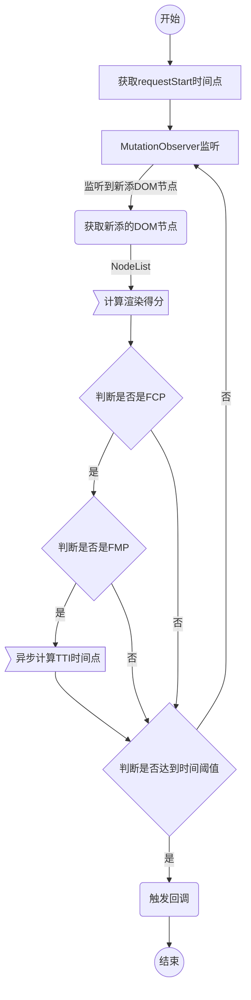
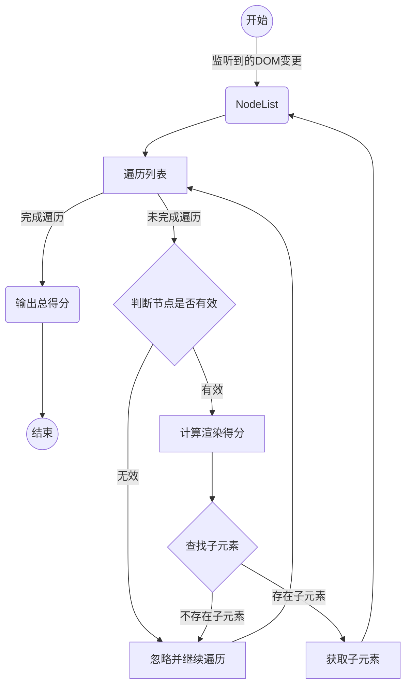
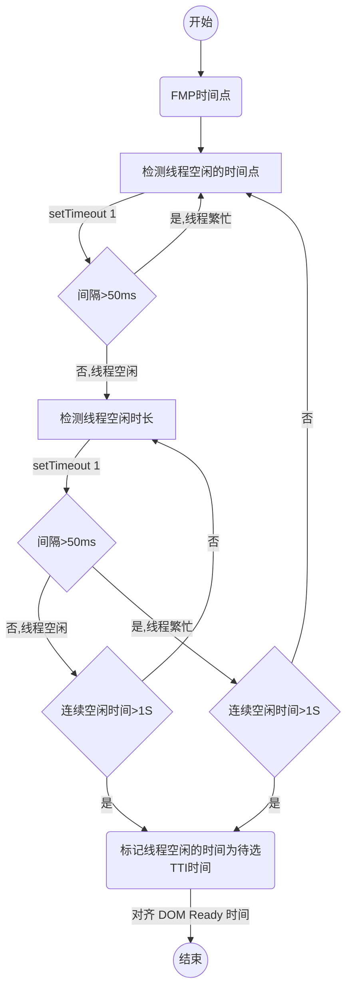
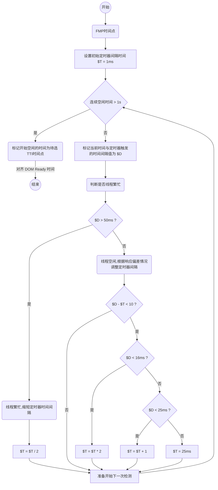

# FMP-TTI
自动化无埋点方式计算页面FCP/FMP/TTI时间

在前端性能监控方面，虽然我们可以通过 `performance timing api` 获得一些浏览器提供的关键节点时间，来数值化的衡量一个页面的性能概况。但这个只是从资源加载解析的角度来看，跟实际用户视觉体验上的页面加载可能不一致。因此我们根据页面加载过程给予用户的视觉体验反馈，定义了以下几个性能指标：

| 用户体验 | 性能指标 | 定义 |
| - | - | - |
| 页面是否正在正常加载 | `首次内容绘制（FCP）` | 首屏部分首次渲染出文本、图片的时间点 |
| 页面是否已加载足够内容？ | `首次有意义绘制（FMP）` | 首屏部分主要元素渲染出来的时间点 |
| 页面是否已经可以操作了 | `可交互时间（TTI）` | FMP 及 DOMContentLoaded 之后，首次 JS 空闲的时间点，此时页面可以响应用户交互 |

在有了性能指标后，常见的方案是进行埋点上报。但这种方案上报逻辑跟业务代码强耦合，接入成本较高。在分析了页面加载流程及各个性能指标点对应关系后，我们做了如下定义：
- `首次内容绘制（FCP）`：首屏部分首次渲染出文本、图片的时间点
- `首次有意义绘制（FMP）`：首屏部分主要元素渲染出来的时间点
- `可交互时间（TTI）`：FMP 及 DOMContentLoaded 之后，首次 JS 空闲的时间点，此时页面可以响应用户交互

明确定义后，我们可以采用 `MutationObserver` 来监听DOM变更，从而分析出各个节点的时间。

## 使用方式

安装组件

```shell
npm i -S fmp-tti
```

根据需要设置页面 TTI 超时时间

```js
// 需要在引入组件前设置，默认值为 5000（5秒）
window.TTI_LIMIT = 5000;
```

在 `<head>` 标签中， `css` 加载前引入组件

- ES6 方式引入
    ```js
    import FT from 'fmp-tti';
    ```
- 外链方式引入
    ```html
    <script src="./fmp-tti/index.iife.js"></script>
    ```

获取检测结果

```js
FT.then(({ fcp, fmp, tti }) => {
    console.log('首次内容绘制（FCP） - %dms', fcp);
    console.log('首次有意义绘制（FMP） - %dms', fmp);
    console.log('可交互时间（TTI） - %dms', tti);
});
```

## 各指标点计算规则

> 通过 `MutationObserver` 监听首屏部分 DOM 树变化，将每次变更量化成渲染得分，根据渲染得分值变化情况来判断当前页面的加载情况。

### 渲染得分计算方式

遍历变更的节点列表，依次判断各个 DOM 节点是否有效

判断条件：
- 挂载在 `body` 节点下
- 位于 `1屏` 范围之内
- 图片节点存在 `src` 属性时有效
- 非图片节点节点需宽高不为 `0`，且存在 `textContent` 或者 `backgroundImage` 时判断为有效

每个有效节点计 `1分`

### 指标点计算规则

| 性能指标 | 定义 | 计算方式 |
|-|-|-
| `首次内容绘制（FCP）` | 首屏部分首次渲染出文本、图片的时间点 | 取总渲染得分首次大于 0 的点 |
| `首次有意义绘制（FMP）` | 首屏部分主要元素渲染出来的时间点 | 选取得分变化最大的区间中得分变化最大的点作为FMP |
| `可交互时间（TTI）` | FMP 及 DOMContentLoaded 之后，首次 JS 空闲的时间点，此时页面可以响应用户交互 | FMP 之后，出现连续 1 秒没有长任务的时间点起点 |

在 `FMP` 的计算过程中，我们采用先判断得分变化最大的区间，再判断该区间中得分变化最大的点，而不是直接判断得分变化最大的点。


当渲染得分变化如上图所示时，页面渲染过程中有两次大的变更，第二次变更大于第一次变更，是目标的 `FMP` 点。但是由于第一次变更大于第二次变更中的任何一次子变更，如果采用直接判断得分变化最大的方法时，程序判定的 `FMP` 会是第一次变更，与实际情况不符。因此我们采用现在的区间判定方法。

`FMP` 判定的区间为不超过 50ms。

对于 `TTI` 的计算，我们采用的方法是判断在 `FMP` 和 DOM Ready 后， JS 线程空闲且接下来 1S 内不存在 LongTask（JS运行时间超过50ms） 的时间点。具体计算时采用比较两次 setTimeout(1) 时间间隔的方式来判断是否存在 LongTask，且会通过类似 TCP 拥塞控制机制的方式来动态调整 setTimeout 的延迟时间，从而减少CPU消耗。

> VS Code中可以使用 Markdown Preview Mermaid Support 插件查看流程图

总的算法整体流程如下：


计算渲染得分流程：


对于 `TTI` 的计算，我们采用的方法是判断在 `FMP` 和 DOM Ready 后， JS 线程空闲且接下来 1S 内不存在 LongTask（JS运行时间超过50ms） 的时间点

`TTI` 计算流程流程：


setTimeout 1 可能会导致大量循环，对性能影响较大，可以根据每次响应间隔时间来调整定时器间隔，优化后的 `TTI` 计算流程流程：


